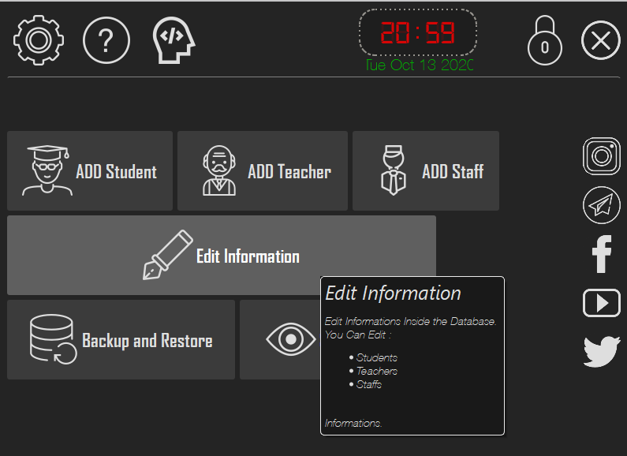
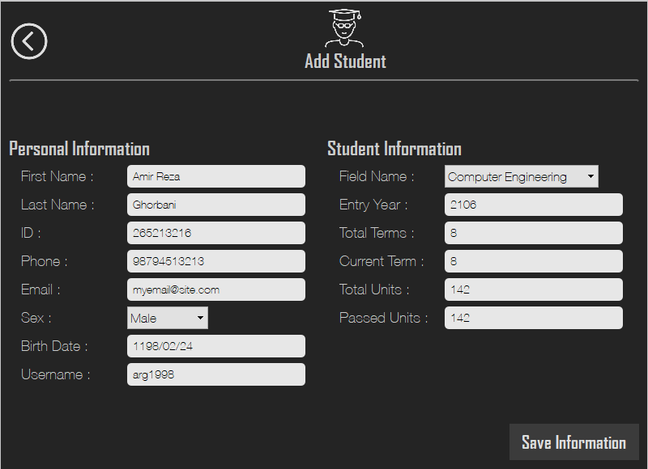
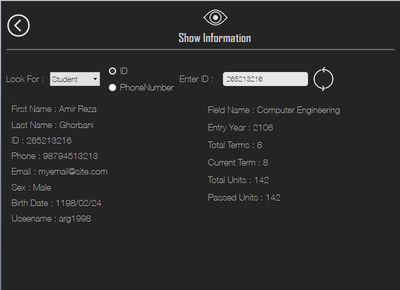
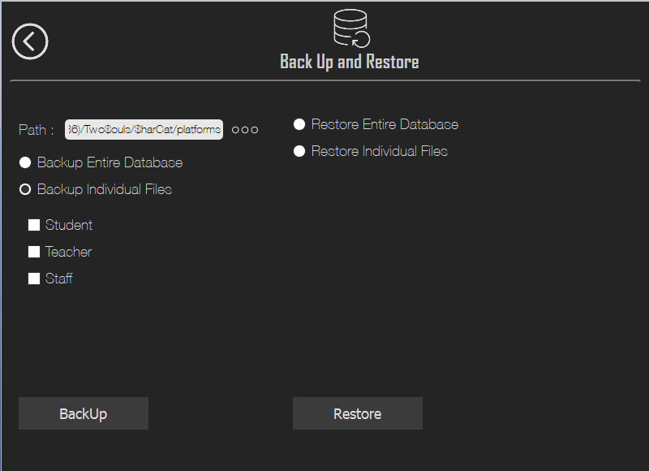

# SharCat : A Student Management Software (Course Project)
Sharcat is a simple **Student Management System** with a custom made local database to store and retrieve individuals information. This application is built for our course project in _Advanced Programming Class_ with Qt framework and stylings are done with _CSS_. 

## Screenshots

